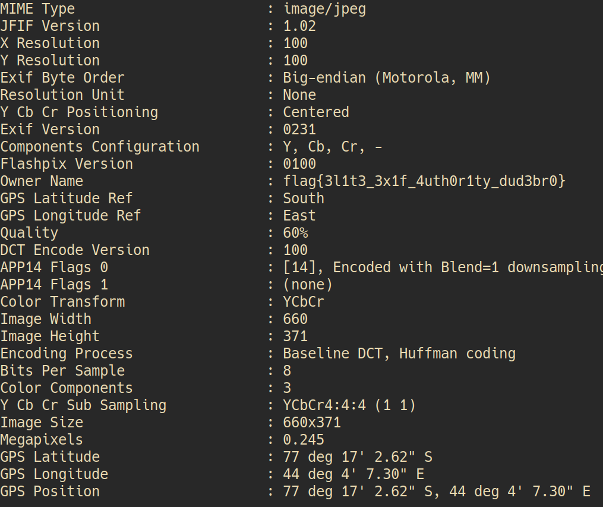

**Forensics**
*Link: https://ctflearn.com/challenge/303*

**Problem**
~~~
Exif
 20 points Easy
If only the password were in the image?

https://mega.nz/#!SDpF0aYC!fkkhBJuBBtBKGsLTDiF2NuLihP2WRd97Iynd3PhWqRw You could really ‘own’ it with exif.
~~~
Using `exiftool` to check it and I have a flag\
\
`Flag: CTFLearn{3l1t3_3x1f_4uth0r1ty_dud3br0}`
