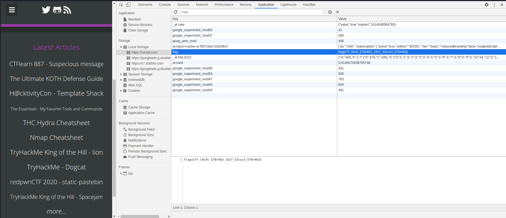

**Web**
*Link: https://ctflearn.com/challenge/979*

**Problem**
~~~
My Blog
 20 points Easy
Hi, I'm Noxtal! I have hidden a flag somewhere in my Cyberworld (AKA blog)... you may find a good application for your memory. ;)

Note: This is my real website (thus no deadly bug to exploit here). You might want to read some of my content (writeups, tutorials, and cheatsheets). I would be glad to receive any kind of feedback.

Click here to access it, have fun checking my blog out! Cheers!

Hint: replace the flag{} part with CTFlearn{}.
~~~
Check local storage and I can see a flag\
\
`Flag: CTFLearn{n7f_l0c4l_570r463_15n7_53cur3_570r463}`
