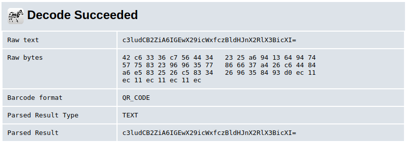
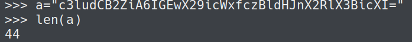
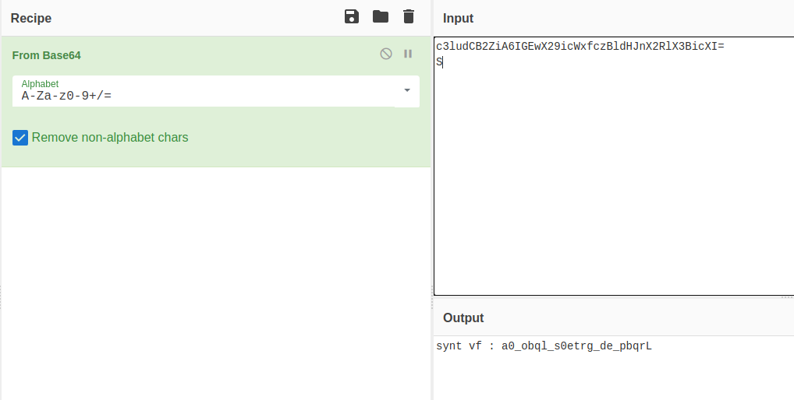
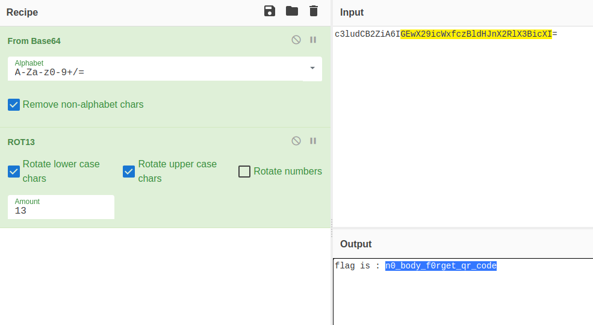

**Miscellaneous**
*Link: https://ctflearn.com/challenge/230*

**Problem**
~~~
QR Code
 30 points Easy
Do you remember something known as QR Code? Simple. Here for you :   https://mega.nz/#!eGYlFa5Z!8mbiqg3kosk93qJCP-DBxIilHH2rf7iIVY-kpwyrx-0
~~~
Using [QR Decoder](https://zxing.org/w/decode.jspx) we have this message:\
\
\
Its length is mutiple of 4, so it's [base64](https://en.wikipedia.org/wiki/Base64)\
Use [CyberChef](https://gchq.github.io/CyberChef/) to decode and have this string\
\
Try rot13 and I have the flag xD\
\
`Flag:CTFLearn{n0_body_f0rget_qr_code}`