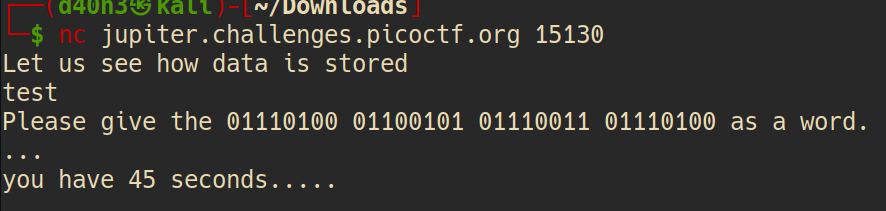

**Cryptography/Based**

After using this command we have\
\
Easy to recognize it's binary string, I use [CyberChef](https://gchq.github.io/CyberChef/) to parse it to text\
Then I get this string\
\
I use [CipherDetect](https://www.boxentriq.com/code-breaking/cipher-identifier) and have result xD\
\
After that, I got another string\
\
And I recognize it's hex, so I use [CyberChef](https://gchq.github.io/CyberChef/) again to parse it to text and get flag xD\
