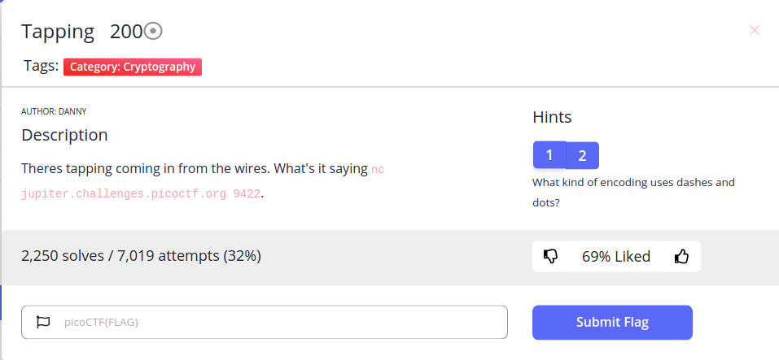
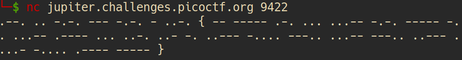
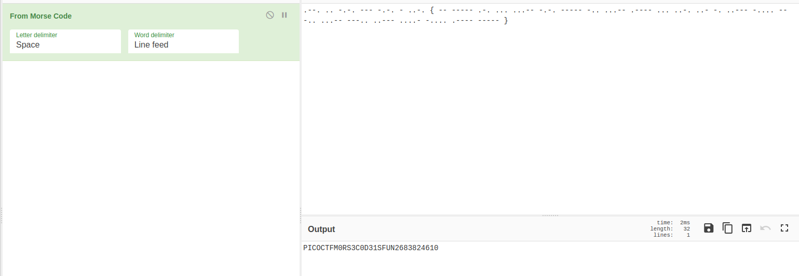

**Cryptography/Tapping**

\
After using this netcat command, we have\
\
Easy to recognize it's [Morse code](https://en.wikipedia.org/wiki/Morse_code) and I use [CyberChef](https://gchq.github.io/CyberChef) to decode it\
\
And we have a flag 
~~~
PICOCTF{M0RS3C0D31SFUN2683824610} 
~~~