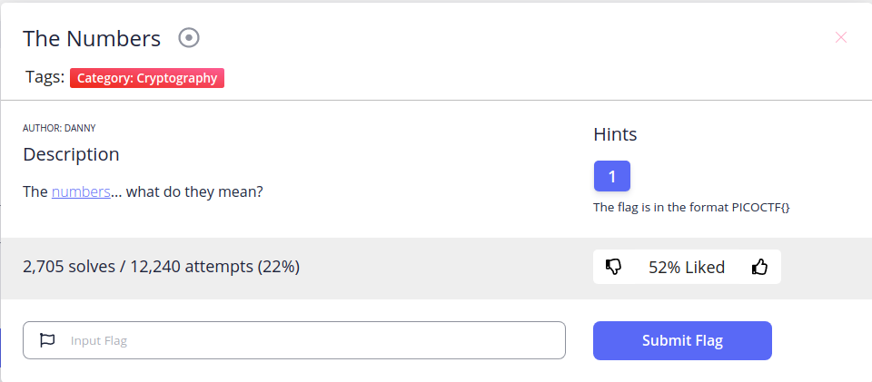
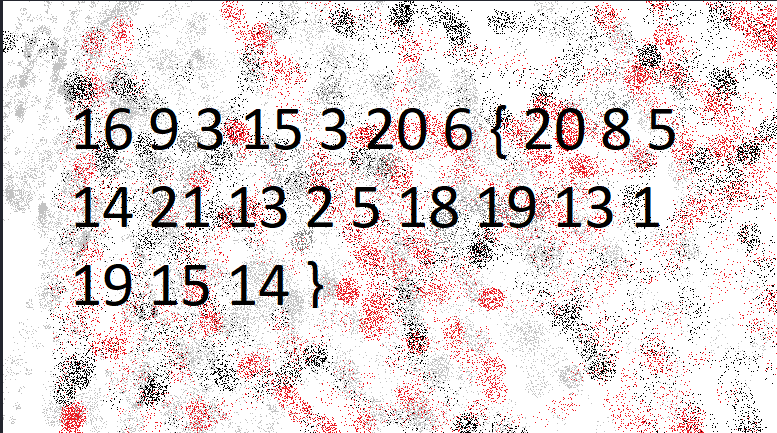
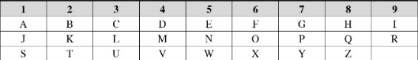

**Cryptography/The Numbers**

Let's download and check this 

Biggest number is 21, so I think it's index of alphabet and replace number with character in alphabet

And have a flag
~~~
PICOCTF{THENUMBERSMASON}
~~~