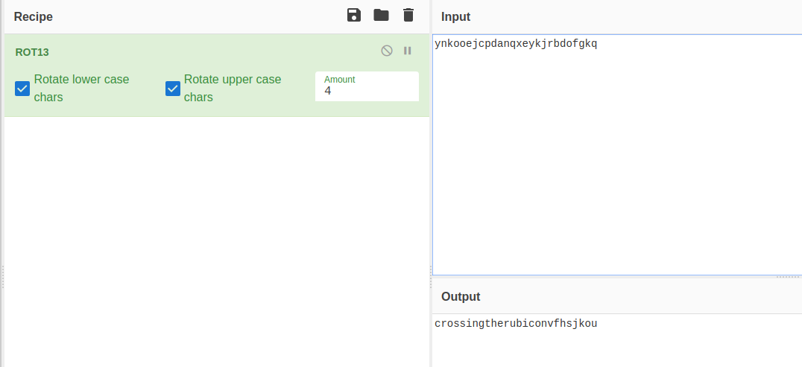

**Cryptography/Caesar**
\
Ok, check this message\
\
This name (caesar) is a hint, so I try to decode it with CyberChef (https://gchq.github.io/) and get a flag\
\
~~~
Flag: crossingtherubiconvfhsjkou
~~~