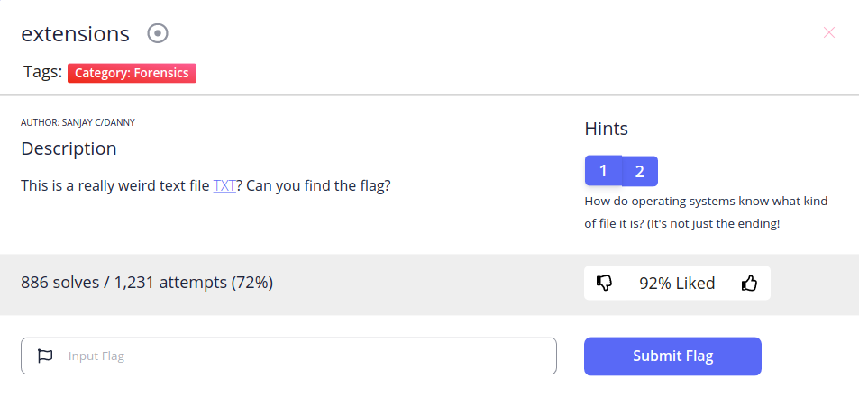
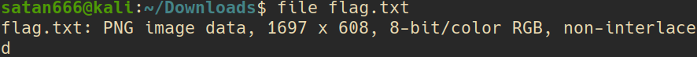
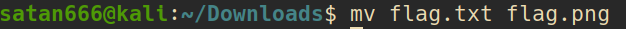
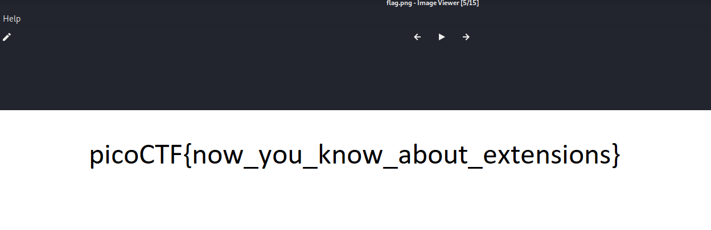

**Forensics/extensions**
\
This name is a hint, I check text file with "file" command\
\
It's PNG img, so I change its extension to png\
\
And open it

~~~
Flag: picoCTF{now_you_know_about_extensions}
~~~