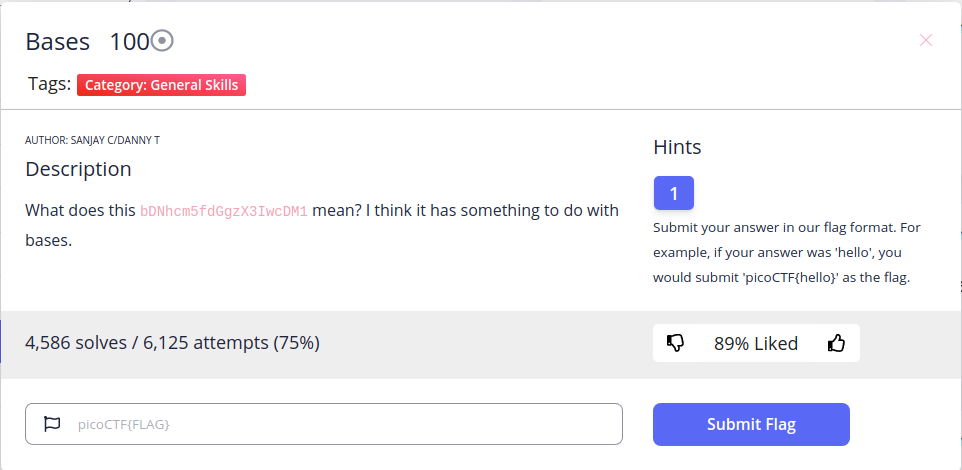
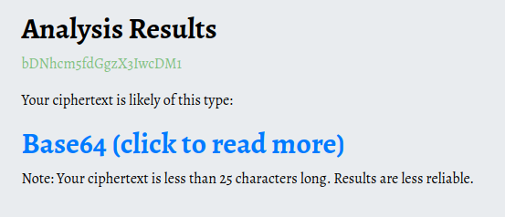
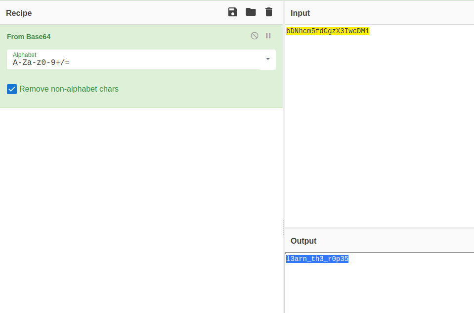

**General Skills/Bases**

\
I use [this site](https://www.boxentriq.com/code-breaking/cipher-identifier) to detect type of this string and have a result\
\
So, I use [CyberChef](https://gchq.github.io/CyberChef/) to decode this base64 string 
\
And we have a flag xD
~~~
Flag: picoCTF{l3arn_th3_r0p35}
~~~
