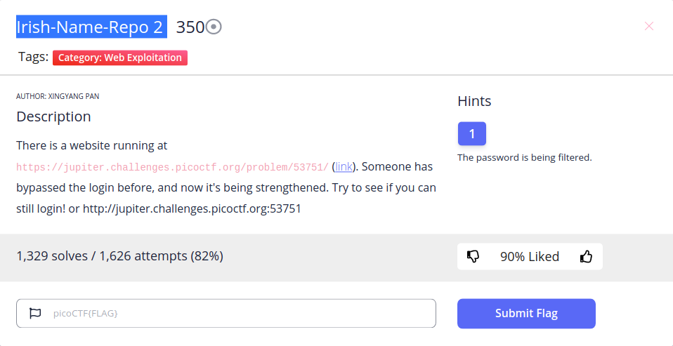
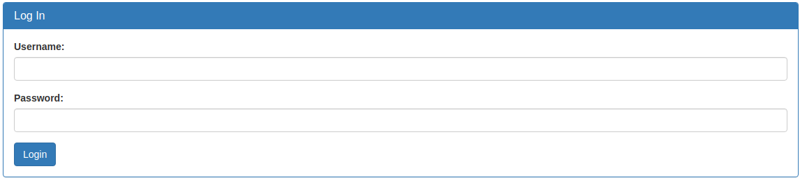
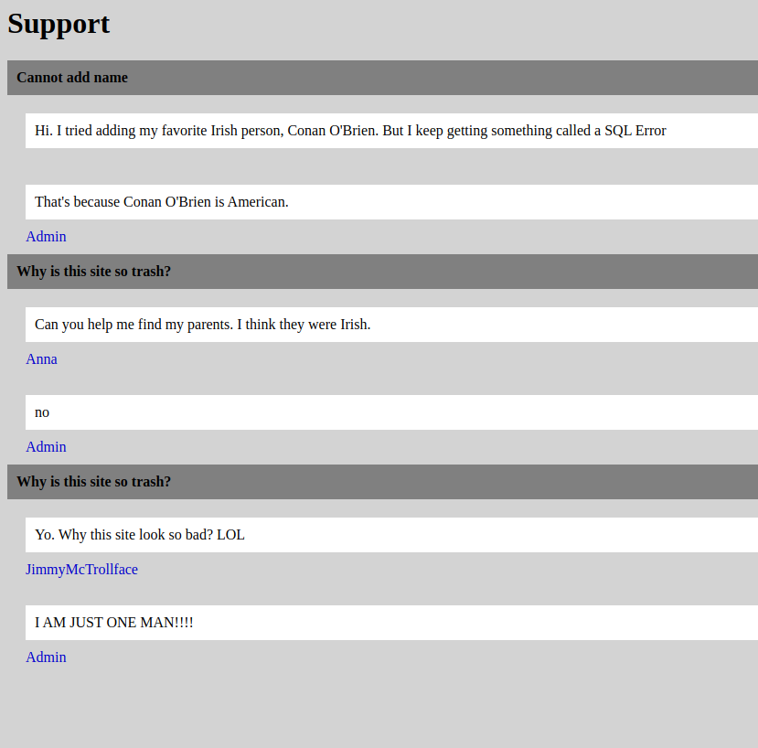
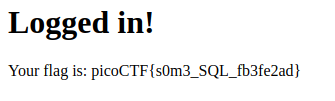

**Web Exploitation/Irish-Name-Repo 2**
\

Click this link, we have a website

\
And a sidebar menu

\
After clicking Admin login, we have a login form
\
I have tried default admin accoutn (**admin: admin**) but it doesn't work xDDD\
So I check another page - *Support* page and find interesting things xD
\
This is SQL Error (SQLi - https://portswigger.net/web-security/sql-injection)
Then I have try my default SQLi payload
~~~
' OR '1'='1
~~~
And it works, we have a flag\
