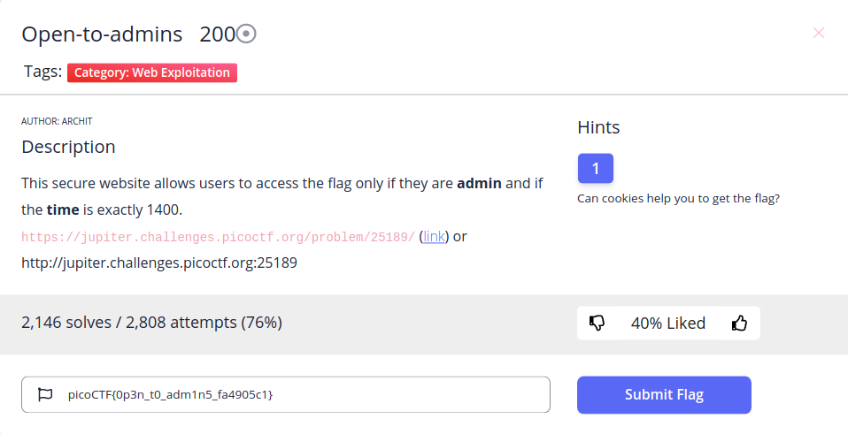
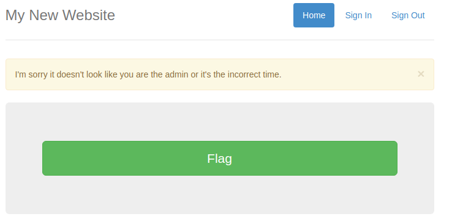
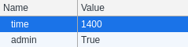
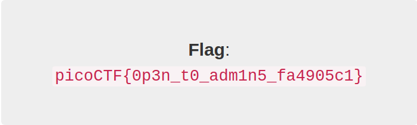

**Web Exploitation/Open-to-admins**

\
First, we can see this description

*This secure website allows users to access the flag only if they are admin and if the time is exactly 1400.*

I open this link, click flag button and have this noti\
\
So I create 2 cookies like this and click flag button again\
\
And we have a flag xD\
